The YCB-Multicam-Dataset
============

Since computer vision is an important aspect in the field of robotics,
the choice of suitable 3D sensors is of great significance. In order to
evaluate the suitability of these sensors, there exists the need for
datasets that include multiple sensors in a comparable fashion. This
dataset was conceived in order to satisfy that need and provide a basis
for a quantitative comparison of 3D sensors with regard to object
recognition.
The dataset provides 32 scenes containing a selection of 20 objects from
the [YCB Object and Model set](http://www.ycbbenchmarks.com/) and is designed to compare
6DOF pose estimation of object recognition algorithms applied to the
data of different cameras.

The scenes also contain a marker board featuring fiducial markers
([ArUco-markers](https://www.uco.es/investiga/grupos/ava/node/26)) which provides a reference frame shared among
the cameras and the ground truth annotations. This marker board also
acts as a calibration means for the inter-camera calibration.

The data in this dataset are divided into two parts, based on the
acquisition method. For the first part the cameras were held in place at
nine fixed positions and recorded sequentially in order to avoid
interference between the sensors. The second part contains recordings of
the scene for which each camera moved in a trajectory around the scene.
Again, the recordings were performed sequentially in order to avoid
interference.

   

Important note: This dataset is not conceived as a training dataset i.e.
for neuronal networks. Since the data are heavily biased (same
background and marker board visible in every scene), the resulting
trained model will most likely yield suboptimal results in data other
than what is provided.

Sensors
=======

We included the following 3D-sensors into the dataset. Sensors that do
not yield RGB images are marked with an asterisk.

**Structured Light**

-   ASUS Xtion Pro Live

-   Orbbec Astra

**Active Stereo**

-   Ensenso N35

-   Intel RealSense R200

**Time of Flight**

-   Microsoft Kinect2

-   PMD CamBoard pico flexx\*

-   Basler ToF Engineering Sample\*

Structure of the dataset
========================

The dataset was recorded using [ROS](http://www.ros.org/) and hence is stored in the
versatile rosbag format. In each rosbag file there are multiple messages
containing the following data:

1.  Raw RGB/infrared image (for convenience also named ’rgb’ in
    the data)

2.  RGB/infrared camera intrinsics

3.  Raw Depth image

4.  Depth camera intrinsics

5.  Pointcloud registered to the rgb/infrared image

In total there are 8064 annotated frames from the snapshots and about
47000 annotated frames from the trajectory recordings. For all frames we
provide the transforms between the camera frames as well as the
transforms from the camera rig to the marker board reference frame.

The folder structure of the dataset:

    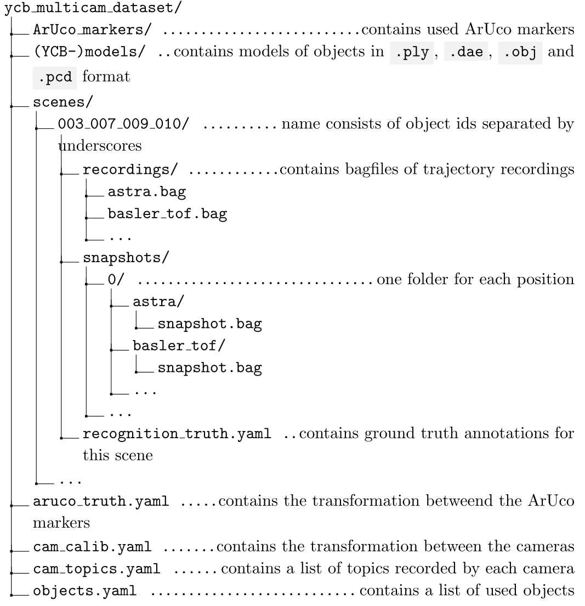

Provided code for evaluation
============================

In this repository we provide an interface for easy access to the
dataset. It is written in Python 2.7 and uses ROS, which is both needed
in order to use this code.

The YCBMulticamDataset class contains the following fields:

`cams` - List of used camera names as strings

`classes` - List of used object classes

... and the following methods:

`get_data(cam[string], source[DataSource], cloud[bool])` - returns a Python Generator which iterates over all available frames of a
given camera and from a given source (i.e. fixed positions, trajectories
or both)

Parameters:

1. `cam` : string containing the name of desired camera as in , e.g.: ’astra’

2. `source` : a value of the enum `DataSource` which can be either `SNAPSHOT` (data from fixed
    positions), `RECORDING` (data from trajectories) or `ALL` (all available data)

3. `cloud` a boolean that indicates, whether the point cloud data should be
    retrieved

The generated frames have the following format:

    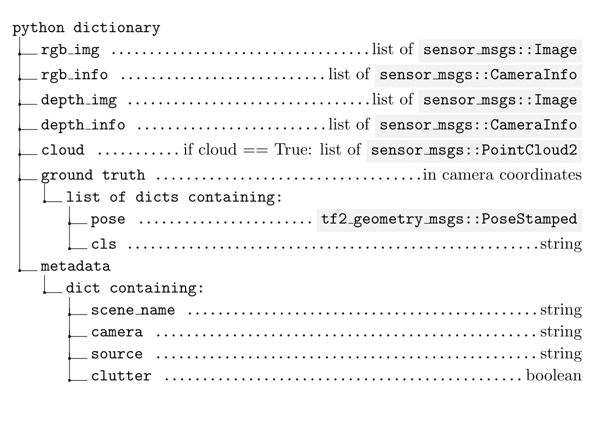

Provided code for visualization
===============================

- edit paths to the datset in the launch/visualizer.launch launchfile
- run `roslaunch ycb_multicam_dataset visualizer.launch`
- run `rosrun rqt_reconfigure rqt_reconfigure`
- edit scene and position in rqt_reconfigure

Sample data
===========

In the following figure we provide some sample data from the dataset.
It contains the depth data captured by all
used sensors, as well as ground truth annotations on its own and
rendered into the scene for the pointcloud of the Ensenso N35 camera.

  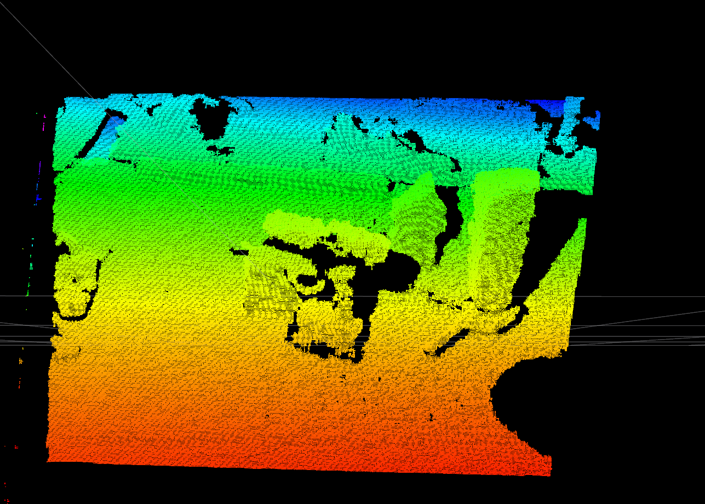
  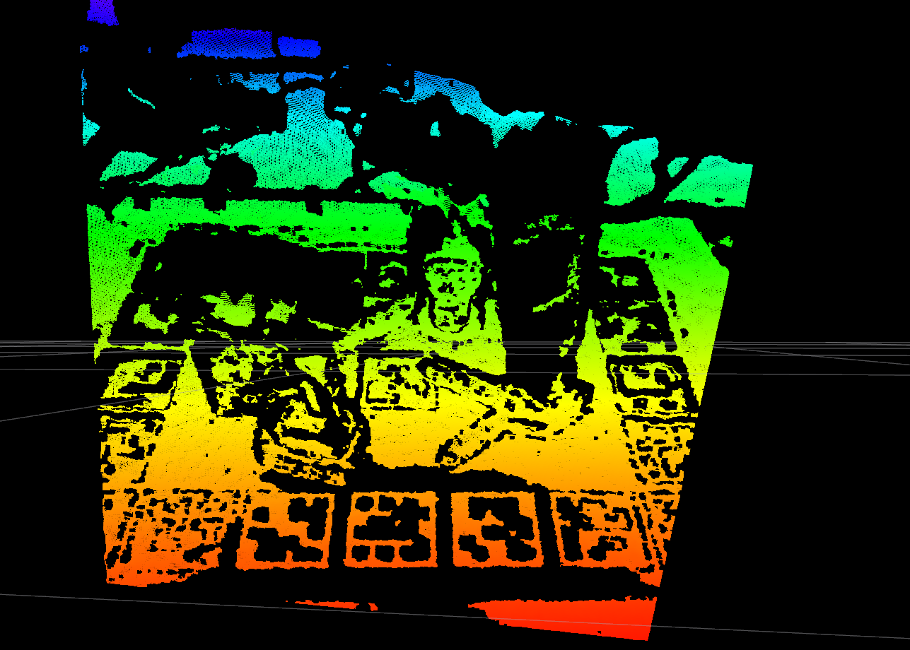 
  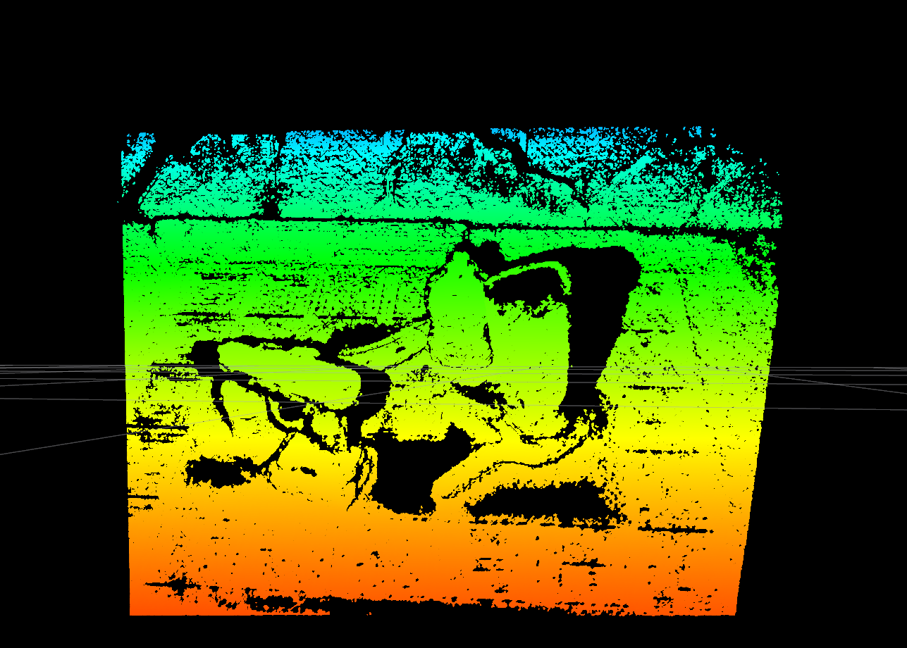

  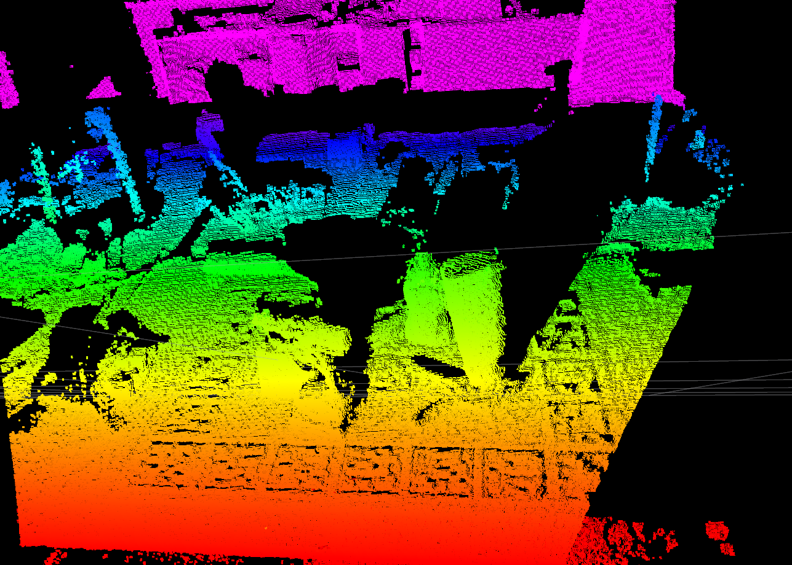
  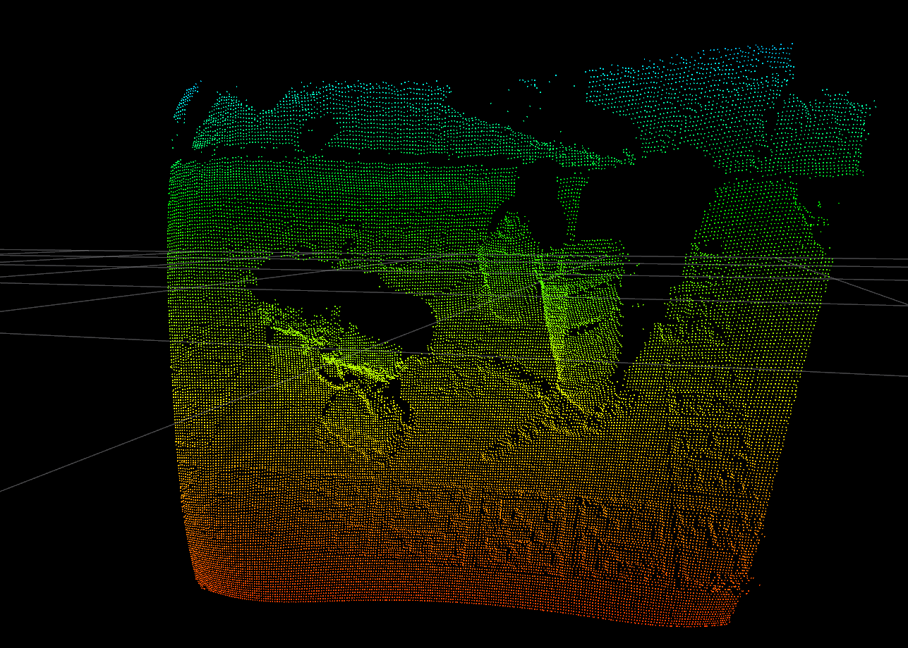 
  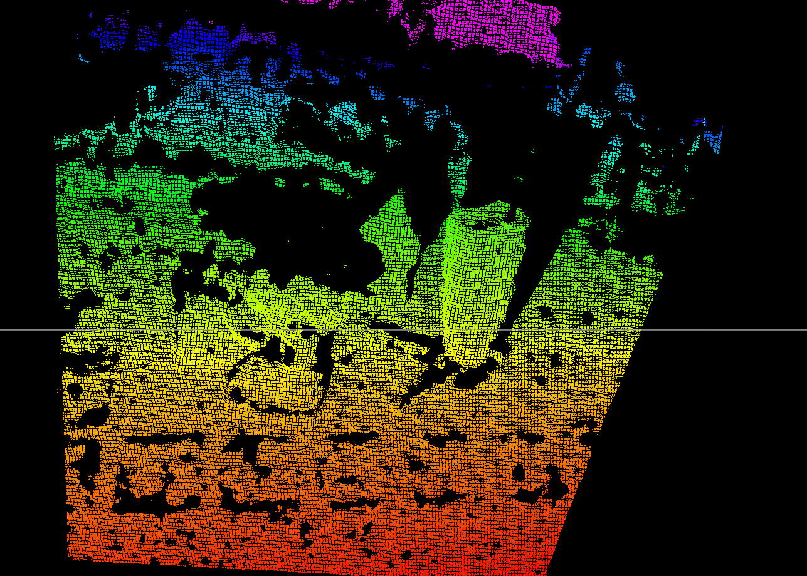

  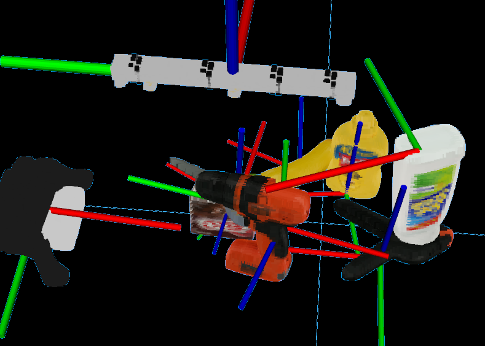
  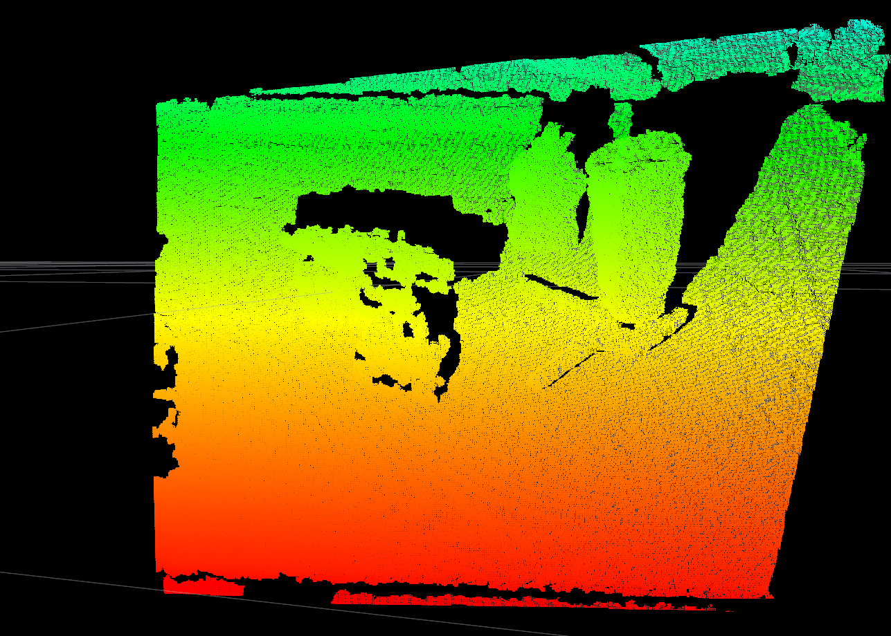 
  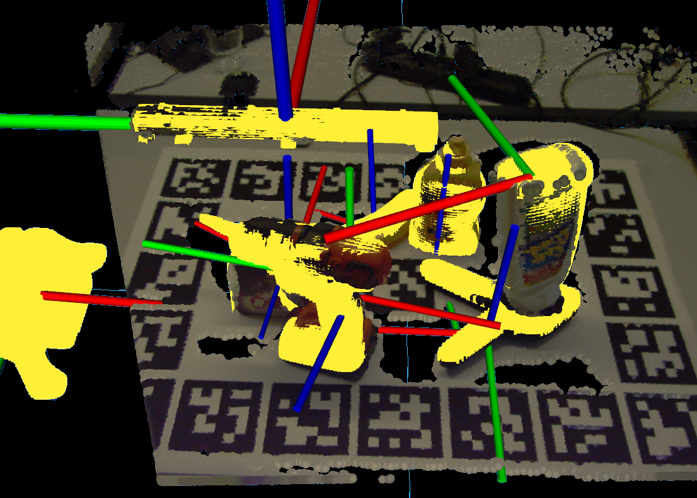

